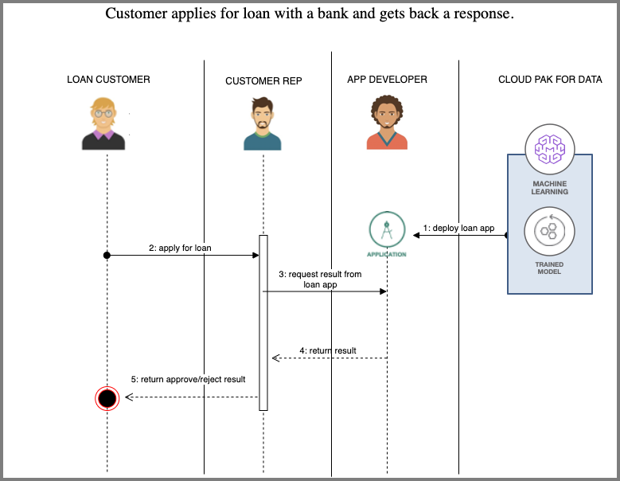
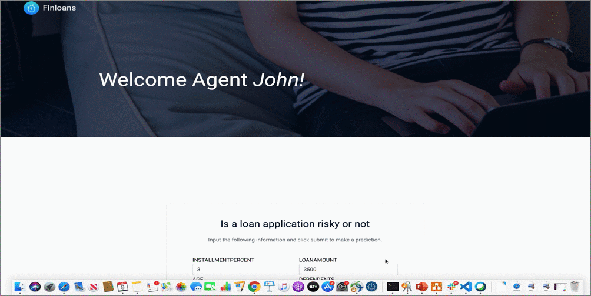

# Create a web based intelligent bank loan application for a loan agent

In this code pattern we will create a web based bank loan application. In a typical bank loan department,  the loan agent will recieve an application from a customer. This loan agent will then consider several factors in order to come to a conclusion of whether loan can be approved or rejected. To ease this decision making process, we build a web based application that the loan agent can use to make these decisions.  This will enable the loan agent to analyze the risk involved while trying to approve loan. The web application is built using Python Flask.

When the reader has completed this code pattern they will understand how to:

* Deploy a Python based web application
* Make a Watson Machine Learning REST API call through web application
* Send and receive messages to a machine learning model deployed using Watson Machine Learning using REST APIs
* Integrate Cloud Pak For Data's Watson Machine Learning services in a web app

## Flow

1. Application developer builds a python based app and deploys it.  
2. Loan Customer approaches the loan agent for a loan through the bank.
3. Loan agent submits loan details through the web based application and gets back risk analysis.
4. Based on the risk analysis results, the loan agent makes a decision about loan application.
5. This result is relayed back to the customer by the loan agent.

## Included components

* [Cloud Pak for Data](https://www.ibm.com/products/cloud-pak-for-data/): A fully-integrated data and AI platform that modernizes how businesses collect, organize and analyze data to infuse AI throughout their organizations.
* [Watson Machine Learning](https://www.ibm.com/cloud/machine-learning/): Deploy models built with IBM Watson Studio and open source tools.

## Featured technologies

* [Flask](http://flask.pocoo.org/): Python is a programming language that lets you work more quickly and integrate your systems more effectively.

## Intelligent loan agent application

This app internally makes REST API calls to the model deployed using *Watson Machine Learning*. [This](https://developer.ibm.com/tutorials/infuse-a-loan-department-platform-with-ai/) tutorial shows us how Watson Studio instances on Cloud Pak for Data can be used to build a model that would predict the risk involved with a loan application. It also covers how this risk model can be deployed using Watson Machine Learning instances on Cloud Pak for Data.

## Deployment options

Click on one of the options below for instructions on deploying the app.

|   |   |   |
| - | - | - |
|  |  |  |

## Sample Loan Submission

 Once the application is deployed via one the three options discussed above and the application is launched, the loan agent can enter loan details of an applicant and review response as shown below.

## License

This code pattern is licensed under the Apache License, Version 2. Separate third-party code objects invoked within this code pattern are licensed by their respective providers pursuant to their own separate licenses. Contributions are subject to the [Developer Certificate of Origin, Version 1.1](https://developercertificate.org/) and the [Apache License, Version 2](https://www.apache.org/licenses/LICENSE-2.0.txt).

[Apache License FAQ](https://www.apache.org/foundation/license-faq.html#WhatDoesItMEAN)
