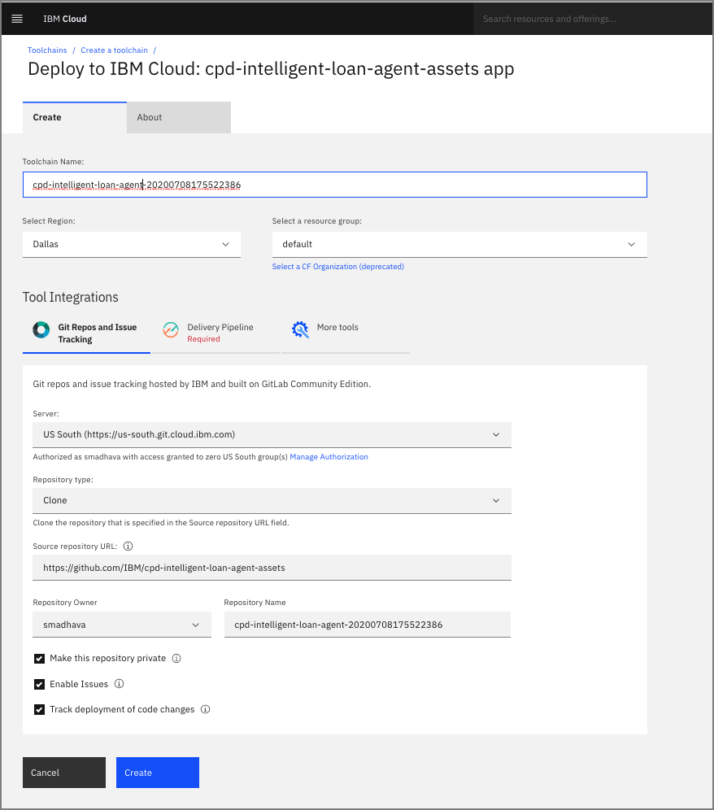
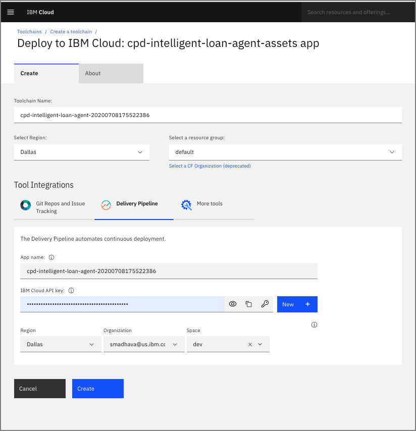
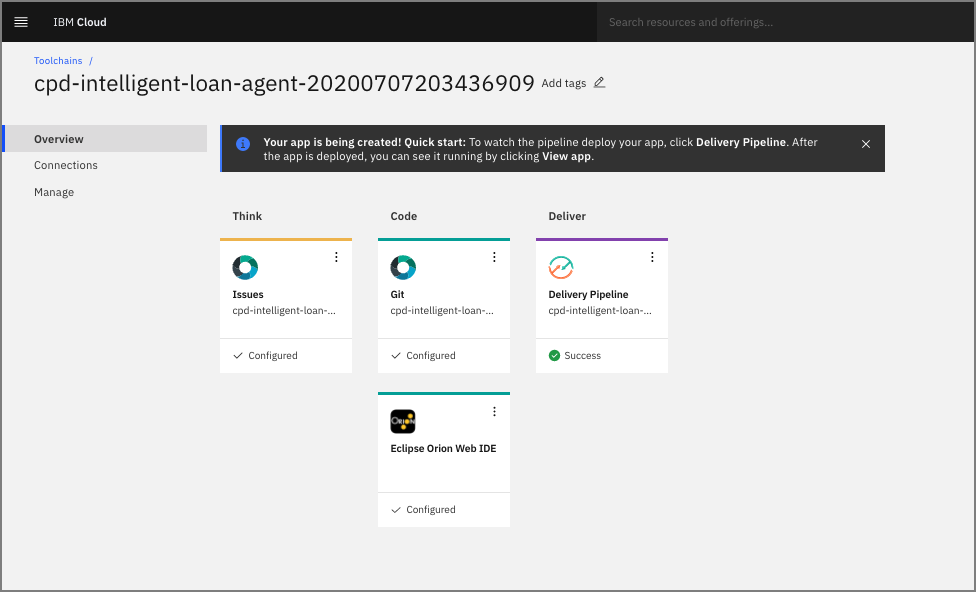

# Run on IBM Cloud with Cloud Foundry

This document shows how to deploy the server using Cloud Foundry on IBM Cloud.

1. Click the above `Deploy to IBM Cloud` button and then click on the `Delivery Pipeline` tool integration.

   

2. Create an API key by pressing the `New+` button located next to the `IBM Cloud API key` field and then `OK` in the pop-up.

    

3. Select your `Region`, `Organization` and `Space`.

4. Click `Create` at the top of the panel to start the deployment process.

5. From the Toolchains view, click on the `Delivery Pipeline` to watch while the app is deployed. Here you'll be able to see logs about the deployment.

   

6. To see the app and services created and configured for this code pattern, use the [IBM Cloud](https://cloud.ibm.com) dashboard. The app is named `cpd-intelligent-loan-agent` with a unique suffix. 

7. CLick on `Runtime` from the menu to the left and switch to the `Environment Variables` tab. Enter values as shown below.

* `AUTH_URL` -  enter auth url of Cloud Pak for Data instance under which the prediction model is deployed.
* `MODEL_URL` - paste in the URL to the machine learning model deployed using Watson Machine Learning. 
* `AUTH_USERNAME` - enter username to Cloud Pak for Data instance under which the prediction model is deployed.
* `AUTH_PASSWORD` -  enter the password to Cloud Pak for Data instance under which 

8. Click on the app and then click on `Visit App URL` visit the bot's web page.
9. Go back to the README to see an example of using the *Intelligent Loan Agent* web app.

