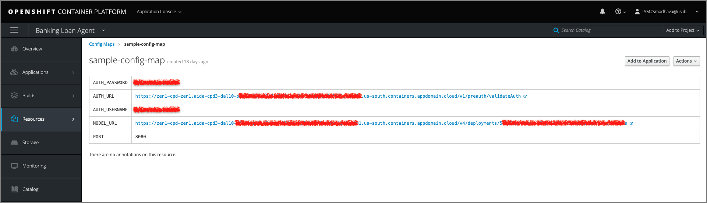

# Run on Red Hat OpenShift

This document shows how to deploy the server using Red Hat OpenShift.

## Prerequisites

You will need a running OpenShift cluster, or OKD cluster. You can provision [OpenShift on the IBM Cloud](https://cloud.ibm.com/kubernetes/catalog/openshiftcluster).

## Steps

1. [Create an OpenShift project](#1-create-an-openshift-project)
1. [Create the config map](#2-create-the-config-map)
1. [Get a secure endpoint](#3-get-a-secure-endpoint)
1. [Run the web app](#4-run-the-web-app)

## 1. Create an OpenShift project

* Using the OpenShift web console, select the `Application Console` view.

  

* Use the `+Create Project` button to create a new project, then click on your project to open it.

* In the `Overview` tab, click on `Browse Catalog`.

  

* Choose the `Python` app container and click `Next`.

  

* Give your app a name and add `https://github.com/IBM/cpd-intelligent-loan-agent-app` for the github repo, then click `Create`.

  

## 2. Create the config map

* Click on the `Resources` tab and choose `Config Maps` and then click the `Create Config Map` button.
  * Provide a `Name` for the config map.
  * Add a key named `PORT` and paste in the `8080` under `Enter a value...`.
  * Click `Add Item` and add a key named `AUTH_URL` and under `Enter a value...`, enter auth url of Cloud Pak for Data instance under which the prediction model is deployed.
  * Click `Add Item` and add a key named `MODEL_URL` and under `Enter a value...`, paste in the URL to the machine learning model. 
  * Click `Add Item` and add a key named `AUTH_USERNAME` and under `Enter a value...`, enter username to Cloud Pak for Data instance under which the prediction model is deployed.
  * Click `Add Item` and add a key named `AUTH_PASSWORD` and under `Enter a value...`, enter the password to Cloud Pak for Data instance under which the prediction model is deployed.
  * Hit the `Create` button.
  * Click on your new Config Map's name.
  * Click the `Add to Application` button.
  * Select your application from the pulldown.
  * Click `Save`.

  

* Go to the `Applications` tab, choose `Deployments` to view the status of your application.

## 3. Get a secure endpoint

* From the OpenShift or OKD UI, under `Applications` ▷ `Routes` you will see your app.
  * Click on the application `Name`.
  * Under `TLS Settings`, click on `Edit`.
  * Under `Security`, check the box for `Secure route`.
  * Hit `Save`.

## 4. Run the web app

* Go back to `Applications` ▷ `Routes`. You will see your app.
* Click your app's `Hostname`. This will open the *Intelligent Loan Agent* web app in your browser.
* Go back to the README to see an example of using the *Intelligent Loan Agent* web app.

